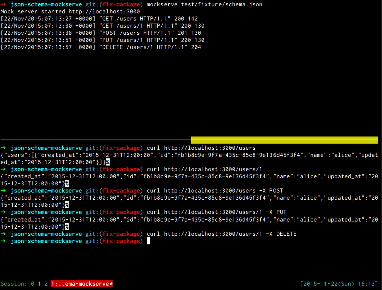

# Json Schema MockServe

json-schema-mockserve is a
mock API server using JSON Schema file.


## Usage

```
$ npm install -g json-schema-mockserve
$ mockserve schema.json -p 8080
```


## Example

JSON Schema file example.
```json
{
  "$schema": "http://interagent.github.io/interagent-hyper-schema",
  "type": "object",
  "definitions": {
    "user": {
      "$schema": "http://json-schema.org/draft-04/hyper-schema",
      "title": "User",
      "description": "fixture for test",
      "stability": "prototype",
      "strictProperties": true,
      "type": "object",
      "definitions": {
        "name": {
          "description": "name of user",
          "example": "alice",
          "type": "string"
        }
      },
      "links": [
        {
          "description": "List existing users.",
          "href": "/users",
          "method": "GET",
          "rel": "instances",
          "title": "List"
        }
      ],
      "properties": {
        "name": {
          "$ref": "#/definitions/user/definitions/name"
        }
      }
    }
  },
  "properties": {
    "user": {
      "$ref": "#/definitions/user"
    }
  }
}
```
In this case, GET /users http response looks like this:
```
[{"name":"alice"}]
```

## Usage with gulp + connect

Install dependencies.
```
$ npm install --save-dev gulp connect serve-static http-proxy-middleware json-schema-mockserve
```

Add gulp task.
```javascript
var gulp = require('gulp');
var connect = require('connect');
var serveStatic = require('serve-static');
var proxyMiddleware = require('http-proxy-middleware');
var MockServe = require('json-schema-mockserve').MockServe;
var path = require('path');

gulp.task('serve', () => {
  // run mock server
  new MockServe({
    port: 3000,
    path: path.join(__dirname, './schema.json')
  }).start();

  // run connect
  connect()
  .use(serveStatic(path.join(__dirname, 'static')))  // your static files directory
  .use(proxyMiddleware([
    '/api'
  ], {
    target: 'http://localhost:3000'    // proxy mockserve
  }))
  .listen(3001);
});
```
